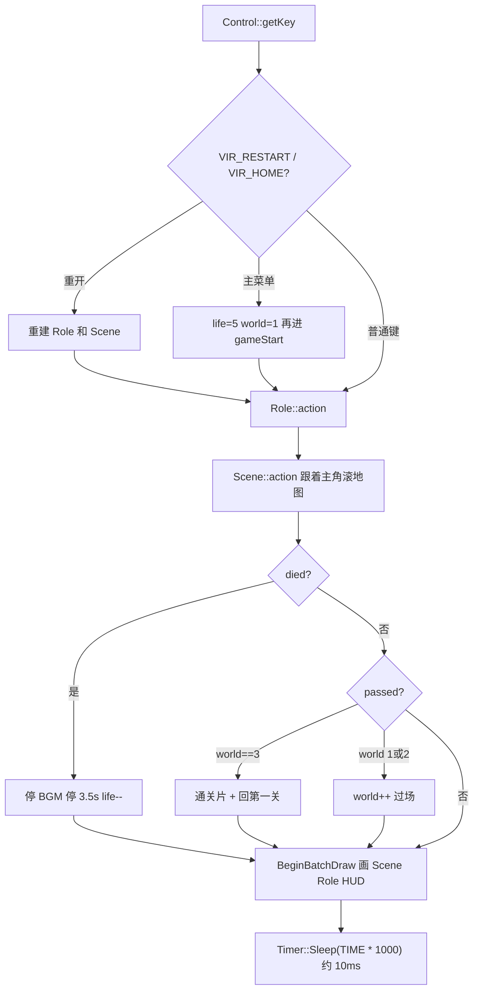

# 架构

猫里奥把一帧拆成「读输入、改状态、画图、睡一帧」。没有实体组件系统，就是三个长寿命对象外加两个工具类。

## 对象寿命

`main.cpp` 里全局只有两条生命相关的整数：

```cpp
int life = LIFE;   // 宏展开成 5
int world = 1;     // 1 / 2 / 3
```

启动后构造一次：

| 对象 | 类型 | 职责 |
| --- | --- | --- |
| `gameCtrl` | `Control` | 主菜单、暂停菜单、死亡/过关字幕、分数和关卡字 |
| `gameRole` | `Role` | 主角运动、敌人 AI、子弹、和地图的相交测试 |
| `gameScene` | `Scene` | 地图块、金币、蘑菇、天空视差 |
| `gameTimer` | `Timer` | `QueryPerformanceCounter` 忙等到下一帧 |

死亡、过关、回主菜单时用 **赋值构造新对象** 重置关卡，而不是写 `reset()`：

```cpp
gameRole = Role(world);
gameScene = Scene(world);
```

这会重新 `loadimage`、重新 `createEnemy` / `createMap`。第三关的管道高度每次都是 `rand()`，所以重开关卡布局会变。

## 一帧顺序



`Role::action` 必须先于 `Scene::action`，因为场景用 `Hero::x0` 和 `vX` 去滚背景。绘制在两者都更新完之后，用 EasyX 的 `BeginBatchDraw` / `EndBatchDraw` 避免闪烁。

## 类之间怎么指

`Role` 和 `Scene` 互相前向声明。`Role` 只握 `Scene*`，碰撞时问 `getMap()` / `getCoins()` / `getFood()`。`Scene::action` 只读 `Role::getHero()` 的原点 `x0` 和速度 `vX`。

`struct Map` 在 `role.h` 和 `scene.h` 里各写了一份，靠 `#ifndef _MAP` 防重定义。字段是：

| 字段 | 含义 |
| --- | --- |
| `x`, `y` | 格子坐标（乘 `WIDTH`/`HEIGHT` 才是像素） |
| `id` | 贴图行号兼碰撞类型 |
| `xAmount`, `yAmount` | 这一段占多少块 |
| `u` | 摩擦系数，给水平刹车用 |

`id` 1–10 参与 `hitMap`。11 以后是草、旗、水、树，只画不挡。

## Control

`GetCommand` 用 `GetAsyncKeyState` 拼位掩码，所以 A 和 D 可以同时按下。`getKey` 先看 `_kbhit()`，再处理 `Esc` → `pauseClick()`。暂停菜单用鼠标点矩形，返回 `VIR_RETURN` / `VIR_RESTART` / `VIR_HOME`。第四项「进行存档」把 `world` 写成 `gameRecord.dat` 后仍返回 `VIR_RETURN`，游戏继续。

主菜单 `gameStart` 是另一套鼠标循环：开始、介绍、指导、退出、读档。介绍和指导是同一张 `home.bmp` 上叠字。

## Role

内部结构体：

- `Hero`：屏幕坐标 `x,y`，亚像素 `xx,yy`，相机原点 `x0`，速度 `vX,vY`，朝向 `turn`（1 右 / -1 左），`isFly` / `isShoot` / `died` / `ending` / `passed`
- `Enemy[30]`：`turn == 0` 表示空槽
- `Bullet[30]`、`POINT bombs[5]`
- 精灵帧计数：`hero_iframe`、`enemy_iframe`、`bomb_iframe[]`、`bullet_iframe[]`

`show()` 里顺便推进子弹飞行 `bullteFlying`（函数名少了一个 l）。爆炸和金币拾取特效也在绘制阶段播完就清坐标。

## Scene

`xMap` 直接等于主角的 `x0`（已经是负数或零）。`xBg` 按 `vX / K_MAP_BG` 更慢地挪，两张天空图首尾相接。`yBg = -(world - 1) * YSIZE`，所以三关共用一张竖着拼起来的 `mapsky.bmp`。

## Inertia 和 Timer

`Inertia::move` 是静态函数，改传入的 `v` 并返回这一步位移。`Timer` 的静态成员在头文件里定义，只能被一个翻译单元包含；现在只有 `main.cpp` 用它。

## 全局耦合

`control.cpp` 用 `extern int world` 写档。`LIFE` 和 `F` 两个宏带了分号：

```cpp
#define F TIME*0.3;
#define LIFE 5;
```

所以 `int life = LIFE;` 其实是 `int life = 5;;`。文档和示例里按「5 条命、0.01 秒一帧」来建模，不依赖这两个带分号的宏。
